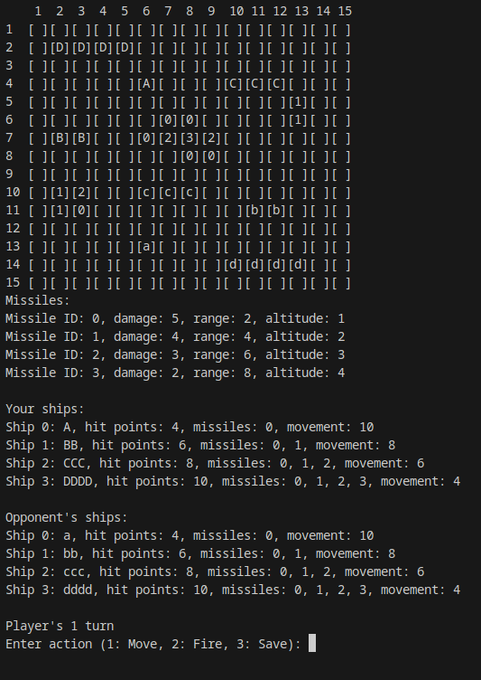

# ⛴️ Ships Game

## 📜 Description

"Ships Game" is a simple naval combat game that allows players to compete against each other. Coded in C++, the game features a terminal interface to display the battlefield.

## 📝 Note

This game was initially developed by a team of three students. After receiving their final grades, two members decided to step away from the project. The game was then moved from the university's GitLab platform to this personal GitHub repository. Since that migration, all the work has been done by me, and the other students have waived their rights to the project. I chose to continue developing it during the summer.

## ✅ Requirements

The game requires C++ 20 or newer.

## 💾 Installation

1. Clone the repository:
    ```sh
    git clone https://github.com/MaciejCieslik1/ShipsGame.git
    ```

2. Navigate to the project **ShipsGame** directory:
    ```sh
    cd ShipsGame/
    ```

3. Compile the project:
    ```sh
    make
    ```

4. Run the game:
    ```sh
    ./program
    ```

## 🎯 Game Preparation

1. **Start**: Allows you to go deeper into game preparation settings.
2. **Languages**: There are 10 languages available.
3. **New Game**: Allows the player to start a new game using hardcoded game parameters. The user must provide the players' names and select a board size from the range of <10, 30>.
4. **Load Game**: Allows the player to load the game state from a file, which includes all game parameters such as players' names, board size, ships, and islands.

**Note**: It is highly recommended to start each game by creating suitable game file and then load it to game.

## ℹ️ Game Rules

In "Ships Game," 2 players compete to destroy the opponent's ships. Every ship is armed with rockets, which are used to attack other ships.

1. **Field and Board**:
   - Each field has X and Y coordinates, which are greater than 0 and lower or equal to the maximum board size. All fields are squares, as is the board. The board size ranges from 10 to 30.
    On one field, there can be a maximum of one ship or island.

2. **Ships**:
   - There are 4 types of ships with different values of health points, size, coordinates, movement, and they carry different rockets. All ships are on the board in a horizontal position, meaning all squares have the same Y coordinate.
   - If a ship has multiple squares, they must be connected as if they formed a rectangle. Ships also have names, described as one character. It is recommended to use different capital letters to name the first player's ships and different lowercase letters to name the second player's ships. The ship is displayed on the board by putting its name letter on every field occupied by this ship.

    **Battleship**:
   - Size: 4 fields
   - Health points: 10
   - Movement: 4
   - Missiles ID's: 0, 1, 2, 3

   **Cruiser**:
   - Size: 3 fields
   - Health points: 8
   - Movement: 6
   - Missiles ID's: 0, 1, 2

   **Destroyer**:
   - Size: 2 fields
   - Health points: 6
   - Movement: 8
   - Missiles ID's: 0, 1

   **Submarine**:
   - Size: 1 field
   - Health points: 4
   - Movement: 10
   - Missiles ID's: 0

3. **Islands**:
   - The game provides islands, displayed similarly to ships, but instead of a name letter in the field, the height is displayed. Each island has height and coordinates. In contrast to ships, the fields occupied by islands do not have to be adjacent.

4. **Missiles**:
   - Every ship carries rockets. Each rocket has damage, range, altitude, and ID. If the rocket hits a field occupied by a ship, damage is dealt. The path of the rocket is calculated using a linear function. If there is an island in the rocket's path and its height is greater than or equal to the rocket's altitude, the rocket hits this island.

    **Missile ID = 0**:
   - Range: 2
   - Damage: 5
   - Altitude: 1
    
    **Missile ID = 1**:
   - Range: 4
   - Damage: 4
   - Altitude: 2
   
    **Missile ID = 2**:
   - Range: 6
   - Damage: 3
   - Altitude: 3

    **Missile ID = 3**:
   - Range: 8
   - Damage: 2
   - Altitude: 4

5. **Turn**: 
   - In a single turn, a player can move a ship to an empty sector on the map, shoot at a chosen ship, or save the file with the current game state. At the end of the turn, the user is asked to confirm their decision or to cancel. If the cancel option is chosen, the turn goes back to the beginning.

## 📄 File Handling

1. **Saving data to file**: If you want to save the current game state, you have to choose the option **Save** during your turn. The player will be asked to type the name of the file in which the game will be saved. If the file does not exist, it will be created. Otherwise, the existing file will be overwritten.

2. **Loading data from file**: Loading data from a file can be done by choosing the option **Load Game** in the menu and then typing the file name. If the filename is incorrect, an error will occur. The file with the game state has a strictly defined form. Any deviation from this form is associated with the inability to load the game state correctly.

3. **Correct structure of file**:
   - [Download the file](https://github.com/MaciejCieslik1/ShipsGame/blob/master/saved/game_example)

4. **Exemplary game state files**: There are a few exemplary files with game states in the **saved** directory.

## 📁 Project Structure

```bash
ShipsGame/       # Contains all game directiories and files, including main.cpp and makefile
│
├── languages/   # Contains language files 
│
├── saved/       # Stores saved game stat files
│
└── Ships/       # Contains all classes and most of data files
│
└── screenshots/ # screenshots
```

# 🖼️ Screenshots
<p align="left">
  
</p>

## 📜 License
This project is licensed under the MIT License. See the [LICENSE](https://github.com/MaciejCieslik1/ShipsGame/blob/master/LICENCE) file for details.

## 📬 Contact
For questions, feedback, or support:
- **Author**: Maciej Cieślik
- **LinkedIn**: [Maciej Cieślik](https://www.linkedin.com/in/maciej-cie%C5%9Blik-1ab60a290/)
- **Instagram**: [@maciek_cieslik](https://www.instagram.com/maciek_cieslik)
- **GitHub**: [MaciejCieslik1](https://github.com/MaciejCieslik1)
- **Support**: Email [maciej.cieslik.official@gmail.com](mailto:maciej.cieslik.official@gmail.com)


