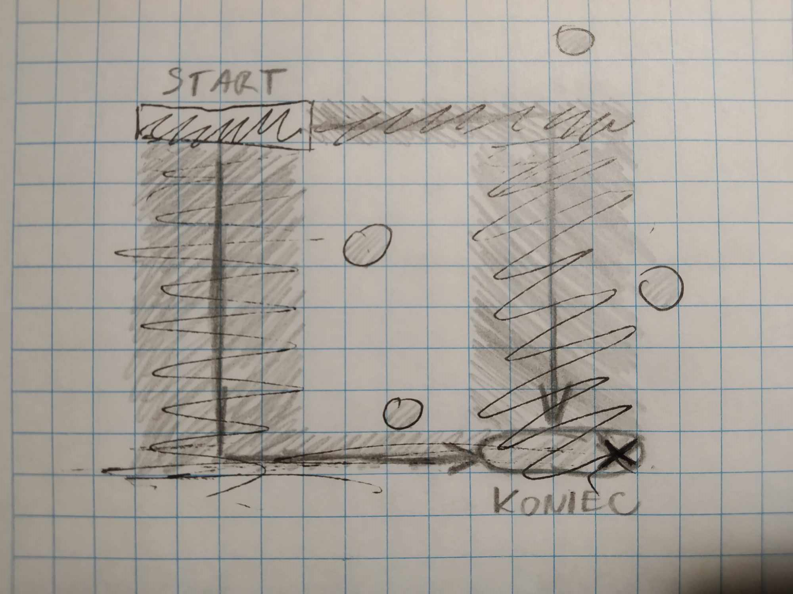
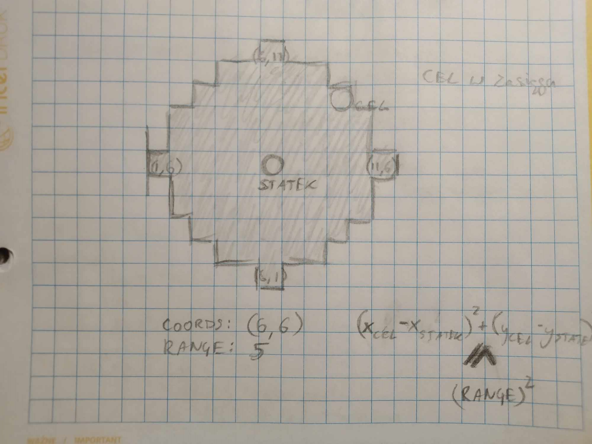
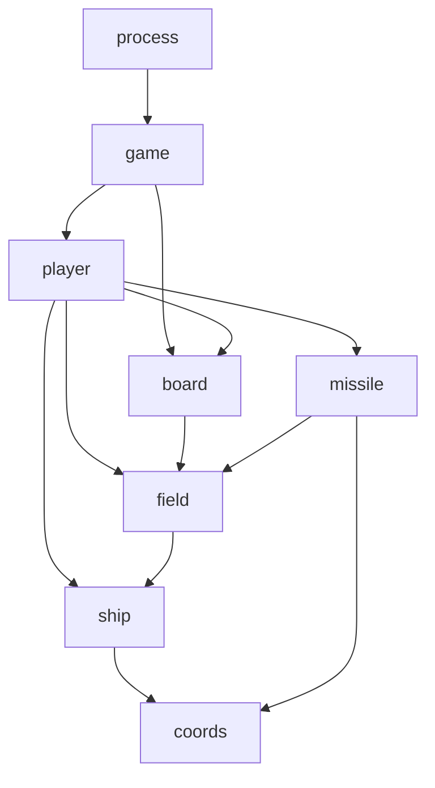

# GRA W STATKI - Projekt PROI 2024L

Stan na dzień 23.05.2024

## Autorzy

> Maciej Cieślik | Kacper Górski | Jerzy Mossakowski

## Temat i cel projektu

Choć hasłem otwierającym projekt była "gra w statki", prędko zdecydowaliśmy się na odejście od konwencji klasycznej planszówki.

Projekt ma na celu realizację prostej turowej gry taktycznej zorientowanej wokół różnego rodzaju okrętów wojennych, sterowanych przez graczy, poruszających się po prostokątnej planszy z kwadratowych pól i strzelających do siebie różnego rodzaju rakietami.

Oprócz samej gry projekt obejmuje również obsługę systemu plików i GUI.

## Gra

Gra toczy się pomiędzy dwoma graczami, którzy wykonują ruchy na przemian. W czasie jednej tury, gracz może ruszyć statkiem lub jego strzelić; o liczbie dozwolonych w czasie jednej tury akcji tego typu decydują ustawienia gry.

### Statki

Statki dzielą się na różne rodzaje, z których każdy charakteryzuje się inną długością, zasięgiem ruchu oraz dostępnymi pociskami. Wszystkie statki mają stałą orientację lewo-prawo i nie mogą się obracać. Ruch statku polega na przesunięciu się o ustaloną liczbę pól w poziomie, a następnie w pionie, nie mogąc jednak przepłynąć w ten sposób przez pole zajęte przez inny statek; umożliwia to taktyczne rozstawianie mniejszych statków tak, by uniemożliwić przeciwnikowi manwery.

*Ryc. 1 - ruch statków*

### Rakiety

Statki mają dostęp do różnego rodzaju pocisków, które różnią się od siebie zasięgiem i efektem. Efekt wywierany jest na polu docelowym; rakiety mogą np. ranić statek, zatopić go, usunąć pole itp. Rakieta może trafić pole tylko wtedy, kiedy leży w zasięgu - tzn. gdy dystans między polem wystrzału a polem docelowym jest mniejszy lub równy zasięgowi rakiety.

*Ryc. 2 - strzał rakiety*

### Plansza

Plansza jest prostokątna składa się z pól sąsiadujących ze sobą, z których każde ma określone koordynaty całkowitoliczbowe (x, y). Efektywnie pola są kwadratowe. Na każdym polu może znajdować się jeden statek, choć jeden statek może mieścić się na wielu polach.

## Implementacja

### Struktura i komunikacja między elementami

Schemat ścieżki *include*:

Obiekt klasy Process inicjowany jest wraz z uruchomieniem programu i zarządza tworzeniem i obsługą obiektów gry.

Obiekt klasy Game tworzony jest, gdy gracz zdecyduje się rozpocząć grę. Gra posiada dostęp do obiektów graczy, odpowiadających jej uczestnikom, oraz obiektu planszy, na której się toczy.

Obiekty klasy Player tworzone są wraz z inicjalizacją gry. Każdy gracz posiada dostęp do listy dostępnych rakiet, listy swoich statków oraz planszy, z której korzysta w grze.

Obiekty klasy Board posiadają listę pól z dostępem do nich po koordynatach.

Obiekty klasy Field posiadają swoje koordynaty, wiedzę o polach sąsiadujących oraz wskaźnik na znajdujący się na nim statek (lub nullptr).

Obiekt klasy Ship posiada dostęp do obiektów pocisków wyłącznie pośrednio przez obiekt gracza za pomocą id typu rakiety, a do obiektów pól wyłącznie poprzez koordynaty.

Obiekt klasy CruiseMissile może odnieść się do określonego obiektu pola, nakazując mu rozpatrzenie efektu swojego trafienia.

Klasa Coords służy do ułatwienia pilnowania, sprawdzania, pobierania i ustawiania współrzędnych dwuelementowych (x, y) dla elementów gry.

Klasa InfoContainer, zbudowana na szablonach, zastępuje wektory, pozwalając na łatwy dostęp do zawartości kontenera i wygodny zapis do i odczyt z plików.

Klasa LanguageManager służy do wyłuskiwania komunikatu z odpowiedniego pliku językowego, który gra i proces będą mogły wyświetlić użytkownikowi.

Klasa FileHandler zajmuje się obsługą dostępu do plików; ma do niej dostęp proces.

Plik ShipsExceptions zawiera własne wyjątki. Plik MFunctions zawiera proste funkcje obliczeniowe stosowane w modułach klas.

### Struktury danych

Do realizacji projektu wykorzystujemy - zamiast wektorów - własną klasę kontenerową InfoContainer, umożliwiającą prosty zapis do pliku i odczyt zeń.

Dla przechowywania współrzędnych pól, statków i pocisków wykorzystujemy własną, prostą klasę Coords przechowującą dwie liczby całkowite.

## Komunikacja z użytkownikiem

Komunikacja z użytkownikiem odbywać się ma docelowo za pośrednictwem prostego GUI przy użyciu biblioteki SFML; komunikaty odczytywane będą z odpowiedniego dla języka pliku tekstowego.

## Obsługa plików

Projekt przewiduje użycie plików tekstowych do kilku różnych celów:

- **Przechowywanie stanu gry:** Program ma umożliwiać zapis stanu gry i odczyt na etapie inicjalizacji gry

- **Dane konfiguracyjne programu:** Program ma mieć możliwość konfiguracji języka i - w miarę możliwości - innych elementów, jeszcze przed uruchomieniem

- **Pliki języków:** Kod źródłowy *nie zawiera* wpisanych z palca stringów; zamiast tego stosowne komunikaty zapisane będą w odpowiednim pliku języka (np. polski, angielski)

## Harmonogram pracy

Praca realizowana była w oparciu o przydział zadań z tygodnia na tydzień, z założeniem stałej komunikacji między członkami zespołu i możliwością korekty podziału pracy. Od wkroczenia w fazę produkcji deadline'y wyznaczały daty czwartkowe:

- [x] **09.05.2024:** Opracowanie ostatecznej idei gry, ustalenie struktury programu, pierwszy definitywny podział ról (mechanika gry & komunikacja ze światem zewnętrznym)

- [x] **16.05.2024:** Stworzenie początkowej dokumentacji, uruchomienie odimiennych gałęzi w repozytorium i utworzenie plików headerowych realizujących ustalone klasy

- [x] **23.05.2024:** Opracowanie ostatecznej wersji dokumentacji, osiągnięcie zaawansowanego lub końcowego etapu prac nad klasami bazowymi i praktyczną logiką programu

- [ ] **30.05.2024:** Planowane jest zakończenie pracy nad funkcjonalnościami głównymi wraz z pluralizmem zapewnianym przez polimorfizm

- [ ] **06.06.2024:** Planowane jest ukończenie projektu wraz z naniesieniem poprawek zasugerowanych przez opiekuna projektu lub, w razie porażki na wcześniejszym etapie, doprowadzenie projektu do stanu używalności

## Struktura repozytorium

Każdy z członków zespołu posiada własną, imienną gałąź w repozytorium, na którą wrzuca bieżące osiągnięcia. Raz na tydzień-dwa gałęzie są spajane ze sobą do gałęzi Development, która zawiera sotatnią działającą i spójną wersję projektu. Gałąź main jest zawieszona w użyciu aż do fazy końcowej projektu.

## Podział ról i zadań

- **Maciej Cieślik:** Projekt, wyobrażenie i urzeczywistnienie mechaniki gry; implementacja kluczowych i najbardziej rozbudowanych klas: Ship, Player, Board; pilnowanie wzajemnej spójności części składowych programu i gry w szczególności
- **Kacper Górski:** System plików oraz komunikacji z użytkownikiem, obsługa wyjątków, pilnowanie składni i wsparcie w zakresie wiedzy o C++; implementacja klas Menu, PlayerInfo oraz własnych klas w miarę potrzeby
- **Jerzy Mossakowski:** Projekt programu, prowadzenie dokumentacji; implementacja klas Game, CruiseMissile, Field, Coords i Process; wprowadzenie polimorfizmu: klasy abstrakcyjne, metody wirtualne, klasy dziedziczące

Podział zadań odbywał się za pełną zgodą wszystkich członków zespołu w wyniku wspólnej konsultacji. Staramy się, żeby nikt nie miał więcej pracy od innych i w razie potrzeby przekazujemy sobie cząstkowe zadania.
